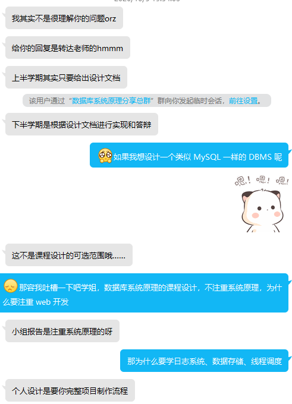
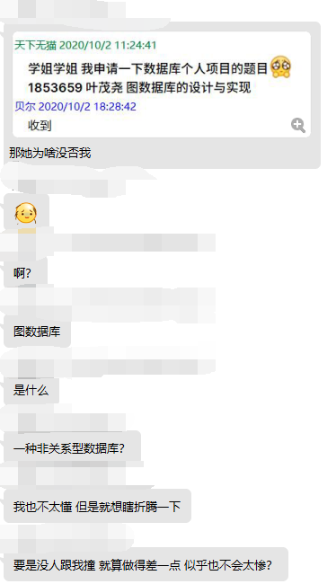
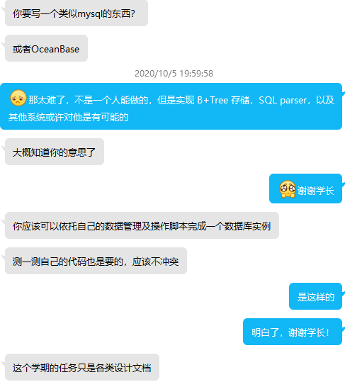

# 数据库系统原理

## 100396 数据库系统原理

### 一、总述

#### 1. 教材

数据库系统概论 （第5版）王珊 萨师煊 高等教育出版社

#### 2. 作业

##### i. 2019-2020 秋季学期

课程可大致分为两部分，一为 SQL 语句，二为数据库系统理论。

上半学期基本用来学习 SQL 语句和数据库的一些基础概念。

下半学期学习数据库较为深入的理论知识。

**03148 Xiang** 期末有特殊的编程作业，要求实现连接了数据库的网站。

##### ii. 2020-2021 秋季学期

由于 **03148 Xiang** 不再教授数据库课程，无论是整体上的选课，还是考核的标准都发生了很大变化，具体体现在本课程任务量增大。

作业总占整体评分的 70%，具体比例如下：

* 签到、课堂提问：10%；
* 课程大作业——数据库系统设计文档撰写：40%；
* 杂项：20%
  * 小组展示 / 个人汇报；
  * 实验报告；
  * 课后习题；
* 调研：10%（属于附加分）

**（注：其中需要说明的是，小组展示的内容必须来源于 OceanBase 以及 OpenGauss 两种国产数据库上）**

**（再注：课程大作业设计的文档是大三下学期数据库系统原理课程设计的系统设计文档，二者一脉相承。如若在大三下换题，需要再写一次系统设计文档）**

尽管本科目名为 **数据库系统原理**，但部分助教表示，**DBMS 却不在课设可选范围内**，有图为证：

**（注：图来自 18 级计算机年级群，不代表该文档编辑者观点，使用图片仅作为阐述事实的辅助材料。该文档编辑者不赞同、不反对、不理解图中任何观点）**

但实际上，助教言语又有前后矛盾的情况发生：（确实为同一名助教）

同时也有不同助教口径不一的情况出现：

目前情况尚不明朗，TBD。

#### 3. 考试

据说之前考的太简单了，之后会一年比一年难。

如：18 级题量据说是 17 级考试题量的 1.5 倍。

每个章节都会有关键考点，比如关系代数；范式的判断；闭包、最小依赖的求法；多线程查询写入；备份恢复都会是考试的重点。

### 二、任课教师

#### 1. 03148 Xiang

**（注：2019-2020 秋季学期后不再担任 数据库系统原理 以及 数据库系统原理课程设计 任课教师）**

基本不可能解决提出的问题，对于课程内容把握不够。

不签到。上课时不管在干什么。

期末前会放往届考题的照片。