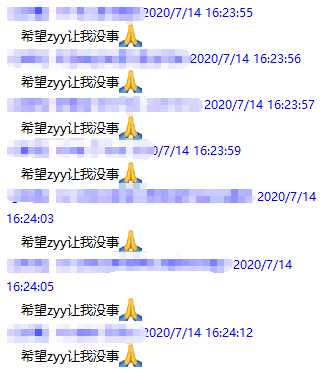
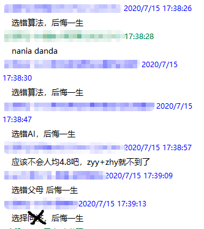
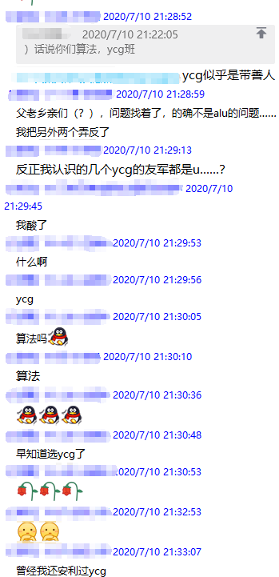

# 算法分析与设计

## 101029 算法分析与设计

### 一、总述

#### 1. 教材

1. 计算机算法设计与分析 （第 4 版） 王晓东 电子工业出版社

#### 2. 作业

作业一共分为两部分，一为平时作业，二为大作业。

* 平时作业又为分两类：
  * 算法分析题，均来自于《计算机算法设计与分析》中；
  * 算法实现题，也是来自于教材习题。
* 大作业（或许是疫情特色）

或许会有一些老师（如 05152 Zhang）编程题所用语言不做要求，只要得出结果即可。

#### 3. 课堂

暂无。

#### 4. 考试

该课程期末以试卷考核。

由于 18 级（2020 春季学期）为线上考核，所以**考核内容或许不具备参考价值**。

[2020 春季学期 期末考试试卷](https://github.com/TJ-CSCCG/TJCS-Course/tree/master/101029_算法分析与设计/doc/exam/2020-Spring)

就 2020 春季学期而言，2 小时开卷作答，难度不高，但题量较大。综合各方面因素，整体难度应该高于以往的考试。

但是考试考什么还得看老师的提示。如 2020 春季学期，05152 Zhang 老师就明确单纯形法解线性规划会考到，也一再强调回溯与分支限界。

### 二、任课教师

#### 1. 05152 Zhang

> 如果最后没有拿到优，也不要找我。因为不是不够优秀，只是其他同学太优秀。 —— Zhang

（误：可能 Zhang 老师当时不会想到，她的这句话在后人眼中，标志着 **计算卷** 时代的来临）

正常的话可能看不出来，但是 Zhang 老师真的是 SJTU CS PhD。

由于大家平时作业交的都蛮好的，所以如果平时作业为大，那么分数拉不开差距。

最后 Zhang 老师在期末加大题量的前提下，**平时作业：期末考试 = 5：5**

#### 2. 99017 Yan

据 17、18 级反馈，Yan 老师给分不错。

Yan 老师的确不太喜欢看群，平常是放养状态，考试前说的话也比较少。

Zhang 老师一开始并没有打算考试，想的是用大作业来做最后的考核。但是 Yan 老师希望考试，之后 **Yan 老师打电话征求了部分同学意见**，最终使得两个班都是考试。（然后 Zhang 老师出的卷子）

2020 春季学期，Yan 老师的比例没有公开，但是应该是调整过。
