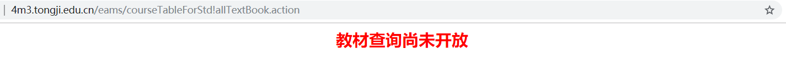

# :tada: TJCS-Course

  


## :ship: 精神

```Chinese
青年是思维最为活跃、最具开拓精神的群体。
改革开放和现代化建设的广阔天地，
到处都是青年建功立业的舞台，
到处都是青年奉献才华的热土。

坚持做到实现自身价值和报效祖国、服务人民相统一，
树立远大理想和脚踏实地、艰苦奋斗相统一，
在实现中华民族伟大复兴中谱写壮丽的青春之歌。
```

为了发扬本校 **`严谨 求实 团结 创新`、`同心同德同舟楫，济人济事济天下`、`同舟共济`、`同济天下`** 等同济精神，深入贯彻落实本院 **晓领导** 的 **`三分技术，七分管理`**，以及 **向导** 的 **`十二分基础数据`** 等各项指导意见，在 Canvas 新生、1 块钱宕机、同心云倒台（再次鞭尸）、课程相关资源来自不易的时代大背景下，随手点了个 Organization 来专门放置 **各项“重要会议文件”**。


## :sob: ​实际

### :cry: 资源距离

学习生活中经常遇到这样一些问题：

* mips 怎么要 VPN 才能上啊，为什么？

* 这个课要上什么啊，是不是我想的那样？

* 下节课上什么，提前学的话那些不用预习？

* 报告模板放到哪里去了，又整丢了？

* 哪位大佬再把那本书的 pdf 发一遍行吗？

* 不知道从什么时候开始

  在每个东西上面都有一个期限

  选课有期限，教务系统登录经常遇到维修

  连教材信息查询有时都会不开放

  我开始怀疑在这个世界上

  还有什么东西是没有期限的？

  

* ……

**计组** 课上，我在家里，因为连不上 VPN，**很多 mips 上的文件都没办法第一时间获取**；**算法** 课的教材 pdf，每次兴高采烈点击，**却发现文件已被清理了一遍又一遍**，只能责怪自己第一时间没有留意；**离散** 考前，**没有样题和实例**，只能依靠老师特别够意思的提示展开复习……

再说的久远些。入校时，学长学姐们在新生群里发布了一个个群文件，可是那些群文件又有多少传到下一届呢。

这些事我相信并不是 **个例**，**我相信我不是一个人**。

然而，这些事情，我们都会再经历一遍，或许在未来的 **体系结构** 上，或许在 **信安原理** 上，或许又是在其他科目。

我们会一次又一次地下决心，决心一天做完所有课的作业。忙活了一天，却发现某门课辅助工具的使用都要花上不少时间学习。

无数人，花费了无数时间在毫无意义，毫无营养的寻找中。

无数人，却只用了一秒钟忘记这个过程。

却仍然有人美其名曰：“**培养搜索能力**”。

诚然，不可能所有资源都有集散平台，大学生就是要有强大的搜索能力和学习能力，这样才能胜任一些位置。没有搜索能力和自学能力的人，不是这所大学希望培养的。

但总不应该一本 **《信息安全体系结构》** 都得在网上翻上个 2 个小时，才能心安理得在群里发出一句：“哪位大佬找到了吗？” 我们与各个资源的距离永远都是一个函数 F，它不因 **他人尝试次数** 损失一分一毫。即便是 **自身搜索经验**，对其削减也微乎其微。

这应该改变。


### :sleepy: 明悟距离

不得不说，有时我会觉得我很天才。

但大多数时间，还是觉得自己是个凡人。

个人认为，让人们自以为是天才的那一瞬间，对他人有着莫大的好处。

或是 **第一次一口气写完千行级别的大作业** 时，或是 **第一次实现红黑树** 时，或是 **第一次在后端接收到了前端发送的请求** 时，更或许是更加简单的，**Hello World!**……

诸如此类，想必这些大学生活中不是那么难以忘记的瞬间，如果记录下来，会在某时、于某地、对某人产生某种帮助。

大家应都有过被他人点醒的经历，也应有自己明悟的经历，但点醒他人却不是人人都有的。

对自己而言，只是举手之劳。但对他人，却意义非凡。


### :joy:人际距离

现实生活中，帮助他人，或许是一件难为情的事。

但在 **全球最大同性 / 异性交友网站** 上，一切都不是问题了。

THIS IS THE WAY!


## :mega: ​声明

初心是这么一句话：

```Chinese
“天下兼相爱则治，交相恶则乱。”
完善全球互联网治理体系，维护网络空间秩序，
必须坚持同舟共济、互信互利的理念，
摈弃零和博弈、赢者通吃的旧观念。
```

于是仓促间点了个仓库，尽管对各个传上来的文件都做了复数次的考量，但可能还是有很多文件不适合上传。

**认同与批判，便利与版权，平安与品茶，默许与删库，二者必有其一。**

还记得上 国领导 课的时候，听他聊一些关于培养方案设计的东西。据说制定培养方案时，参考了国内外许多知名高校，举个例子，小学期就是美国某大学有才加的。（那么这种东西，应该同理吗？


## :church: ​免责（保护

仓库中的资料怎么想都不应该商用吧，**商用是禁止的**。

仓库中所有文件，若侵，联系确人后立删；版权只属于文件作者；拒绝未经允许的使用、分发、传播；仅用于项目所有人的存储。（）

### :warning: 危险

怎么想都很危险。点这个仓库，没和任何人交流和讨论……

所以必定有很多不适合上传的内容。

但是没有关系，部分资源一旦倒牌，尽量给出获取地址吧……

如果 skyleaworlder 倒牌了，删库了，那就算了。
